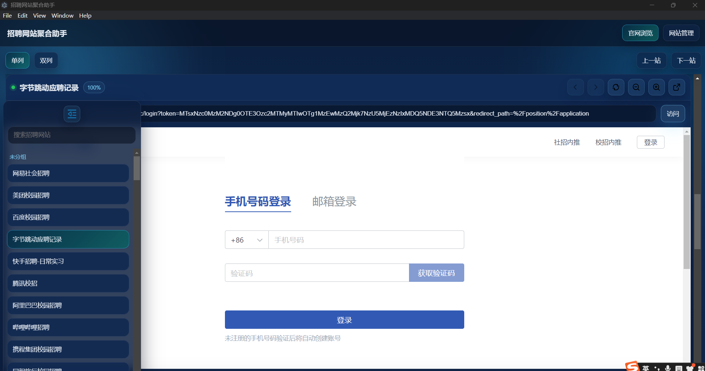
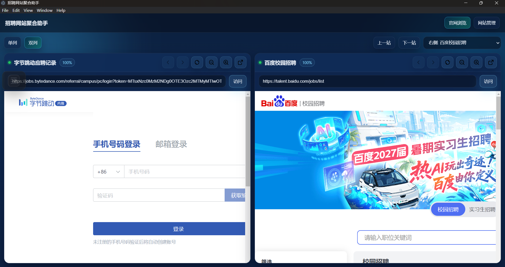
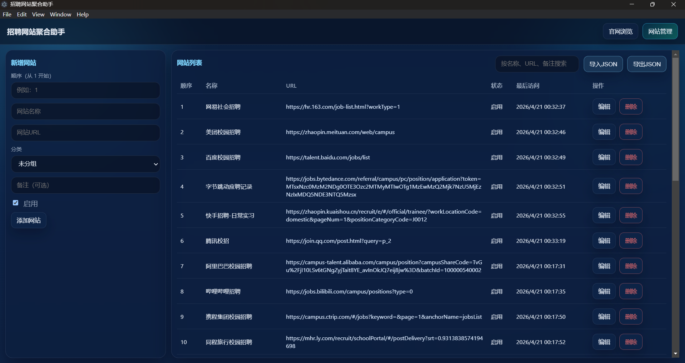
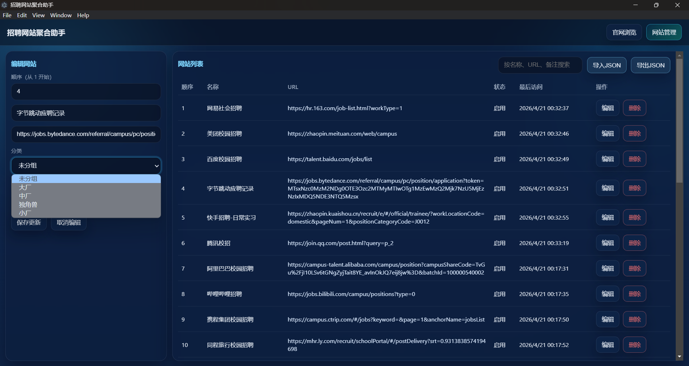

# Recruitment Assistant

一个基于 `Electron + React + SQLite` 的桌面端招聘网站聚合工具，帮助求职者在一个应用内集中管理和访问多个企业招聘官网。

## 下载安装

### Windows 用户（推荐）

1. 访问 [GitHub Releases](https://github.com/linyshdhhcb/RecruitmentAssistant/releases/tag/v1.0.1)
2. 下载 `RecruitmentAssistant-v1.0.1-win-x64.zip`
3. 解压到任意目录
4. 运行 `RecruitmentAssistant.exe`

**系统要求：** Windows 10/11 (64位)

### 开发者安装

从源码构建请参考下方的「快速开始」章节。

## 功能特性

- 官网浏览页
  - 左侧站点导航（可展开/收起）
  - 关键字搜索
  - 单列 / 双列展示模式切换
  - 按 `category` 分类分组展示
  - 站点登录状态持久化（`webview partition`）
- 网站管理页
  - 新增 / 编辑 / 删除网站
  - 启用 / 停用控制
  - 按名称、URL、备注查询
  - 拖拽排序（自动持久化）
- 配置备份恢复
  - 导出 JSON
  - 导入 JSON（覆盖恢复）

## 运行截图







##  技术栈

- **Electron** `28.3.3` - 跨平台桌面应用框架
- **React** `19.x` - 前端 UI 框架
- **Vite** `6.x` - 现代化构建工具
- **SQLite** (`better-sqlite3@9.6.0`) - 本地数据库

## 快速开始

### 环境要求

- Node.js 20.x（推荐 `20.18.1`）
- npm 10+
- Windows PowerShell（用于一键修复脚本）

### 安装依赖

```bash
npm install
```

### 开发运行

```bash
npm run dev
```

应用将在开发模式下启动，支持热重载。

### 一键修复（推荐）

当你遇到以下问题时，优先执行修复脚本：
- `npm install` 卡住
- `Electron failed to install correctly`
- `better-sqlite3 NODE_MODULE_VERSION` 不匹配
- `5173` 端口占用

```bash
npm run fix:dev-env
```

修复后再启动：

```bash
npm run dev
```

如果希望修复后自动启动开发环境：

```bash
npm run fix:dev-env:run
```

### 构建生产版本

#### 构建前端资源

```bash
npm run build:renderer
```

#### 打包 Windows 安装包

```bash
npm run build:win
```

生成的安装包位于 `release/` 目录。

### 生产模式启动（需先构建）

```bash
npm run start
```

## 项目结构

```
RecruitmentAssistant/
├─ electron/              # Electron 主进程代码
│  ├─ main.js            # 主进程入口 + IPC 通信
│  ├─ preload.js         # 预加载脚本（安全桥接 API）
│  └─ db.js              # SQLite 数据访问层
├─ src/                   # React 前端代码
│  ├─ App.jsx            # 主界面组件（浏览页 + 管理页）
│  ├─ main.jsx           # React 应用入口
│  └─ styles.css         # 全局样式
├─ scripts/               # 辅助脚本
│  ├─ fix-dev-env.ps1    # 开发环境一键修复
│  └─ gen-icon.js        # 图标生成工具
├─ build/                 # 构建资源（图标等）
├─ dist/                  # 前端构建输出
├─ release/               # 打包输出目录
├─ imgs/                  # 文档截图
├─ 企业招聘官网.json       # 初始化站点数据
├─ data.sqlite            # 本地数据库（运行后生成）
└─ package.json           # 项目配置
```

## 数据说明

### SQLite 数据库表结构

`website` 表核心字段：

| 字段 | 类型 | 说明 |
|------|------|------|
| `id` | INTEGER | 主键，自增 |
| `name` | TEXT | 网站名称 |
| `url` | TEXT | 网站地址 |
| `category` | TEXT | 分类标签 |
| `notes` | TEXT | 备注信息 |
| `sort_index` | INTEGER | 排序索引 |
| `is_enabled` | INTEGER | 启用状态（0/1） |
| `created_at` | TEXT | 创建时间 |
| `updated_at` | TEXT | 更新时间 |
| `last_visited_at` | TEXT | 最后访问时间 |

数据库文件位置：`data.sqlite`（首次运行后自动生成）

## 常见问题排查

### `npm install` 一直卡住

**原因：** Electron 二进制文件下载缓慢或中断

**解决方案：**
- 不要在 Electron 下载阶段频繁 `Ctrl + C`
- 执行 `npm run fix:dev-env` 自动重建依赖并修复常见锁问题
- 检查网络连接，必要时配置 npm 镜像源

### `Electron failed to install correctly`

**原因：** `node_modules/electron` 不完整或损坏

**解决方案：**
```bash
npm run fix:dev-env
```
脚本会自动执行 `npm rebuild electron` 修复安装。

### `better-sqlite3 ... NODE_MODULE_VERSION ...`

**原因：** 原生模块 ABI 与 Electron 版本不一致

**解决方案：**
```bash
npm run fix:dev-env
```
脚本会固定 Electron 到兼容版本并重建 `better-sqlite3`。

### `Port 5173 is already in use`

**原因：** 开发服务器端口被占用

**解决方案：**
- 脚本会自动释放占用 `5173` 的进程
- 也可以手动执行：

```powershell
# 查找占用端口的进程
netstat -ano | findstr :5173

# 终止进程（替换 <PID> 为实际进程 ID）
taskkill /PID <PID> /F
```

### 打包失败或下载 Electron 超时

**解决方案：** 配置国内镜像源

```bash
# 设置 Electron 镜像
npm config set ELECTRON_MIRROR https://npmmirror.com/mirrors/electron/

# 设置 electron-builder 镜像
npm config set ELECTRON_BUILDER_BINARIES_MIRROR https://npmmirror.com/mirrors/electron-builder-binaries/

# 重新打包
npm run build:win
```

## 作者信息

- **作者：** linyi
- **邮箱：** jingshuihuayue@qq.com
- **GitHub：** [linyshdhhcb/RecruitmentAssistant](https://github.com/linyshdhhcb/RecruitmentAssistant)
- **最新发布：** [v1.0.0](https://github.com/linyshdhhcb/RecruitmentAssistant/releases/tag/v1.0.0)

## License

本项目采用 MIT 许可证 - 详见 [LICENSE](LICENSE) 文件

---

**⭐ 如果这个项目对你有帮助，欢迎在 GitHub 上点个 Star！**
